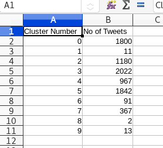
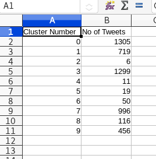

# twitter-analytics
twitter scrapers for analysis

* for running the scripts given in the steps following libraries are used.

* `tweepy`
* `jsonpickle`

### for downloading required libraries
```bash
pip3 install -r requirements.txt
```

* for machines with only a single python installed we can use `pip` directly instead of `pip3`

## for step one

### format for the step one

|serial_number | screen_name| user_id| tweet_id| retweet_count| date| tweet|
| ----         |  ----------| -------| --------| --------     | --- | ---- |
|              |            |        |         |              |     |      |

```python3
python3 extract_tweets.py input
```
* This will download the tweets in `problem_large.txt` file.
* Then run the following command.

```python3
python3 txt_to_csv.py
```
* This will produce `output.csv` file.

## for step two

Step 2:  from the step 1 output observe( 5th column of the table) i.e number of re tweets obtained for each  tweet .
If number of re tweets obtained for the given tweet is  0 then discard the tweet other wise print the tweet in the above format.

Output :  print only the tweets which got re tweets and discard the tweets with no re tweets

* The step to do is copy `output.csv` into this `step_2` folder.

```python3
python3 remove_zero_tweets.py
```
* The output will be a `step_two_output.csv` file
* This will contain the tweets with more than zero retweets.

## for step three

Step 3: Find out number of users who has been tweeted those tweets in step 2, because one user may post multiple tweets.

Input: output of step 2

Output:

|serial_number | user_name @mention | user_id| #tweets (no of tweets posted by user)|
| ----         |  ----------        | -------| --------                             |
|              |                    |        |                                      |

The folder `step_3` should contain `step_two_output.csv`

```bash
mkdir step_3
cd step_3
cp path/twitter-analytics/step2/step_two_output.csv .
```
run the following python code

```python3
python3 unique_user_identifier.py
```

## for step four
All the users who are there in the output of step 3 are not influential users, to find out
Influential users from the above table, find out no of retweets obtained for each user
and calculate weight or user rank.

Input: Step 2 output

output format:

|serial_number | user_name @mention | user_id| #tweets (no of tweets posted by user)| # retweets | log(#retweets)|
| ----         |  ----------        | -------| --------                             | ----       | -----         |
|              |                    |        |                                      |            |               |


```bash
mkdir step_4
cd step_4
cp path/twitter-analytics/step2/step_two_output.csv .
cp path/twitter-analytics/step3/step_three_output.csv .
```

```python3
python3 influential_users.py
```

## for step five
from the above table from step four, we've calculated weights of each user, from that pick out those users,
whose weight > 1.5

Input: step_four_output.csv

Output format:


|serial_number | user_name @mention | user_id| #tweets (no of tweets posted by user)| # retweets | weights > 1.5 |
| ----         |  ----------        | -------| --------                             | ----       | -----         |
|              |                    |        |                                      |            |               |


```bash
mkdir step_5
cd step_5
cp path/twitter-analytics/step4/step_four_output.csv .
```

```python3
python3 weighted_users_seperator.py
```

## for step six
In step five, 2nd column of the table, count the number of users, # users are called as `Influential Users`


## for step seven
For Influential users, calculate global influential score for each user.


```bash
mkdir step_7
cd step_7
cp path/step_5/step_five_output.csv .

python global_influence_score_calculate.py
```


|serial_number | user_name @mention | user_id| #tweets (no of tweets posted by user)| # retweets | global Inf score|
| ----         |  ----------        | -------| --------                             | ----       | -----           |
|              |                    |        |                                      |            |                 |


## for step eight
write down global influence scores in descending order and give rank to each influential user.

example:
highest value of influential score = rank `1`
.
.
.
lowest value of influential score = rank `n`

```bash
mkdir step_8
cd step_8
cp /path/step_7/step_seven_output.csv .

python rank_assign_inf_score.py
```

Input:
step seven 6th column

Output format:

| global influential score in descending order |    user name    | global rank x_i |
| ---                                          | ---             | ---             |
|                                              |                 |                 |


## for step nine

* collect tweets of the influential users from the output of step two
* count no of tweets posted by influential users

```bash
mkdir step_9
cd step_9
cp /path/step_4/step_four_output.csv .
cp /path/step_8/step_eight_output.csv .
cp /path/step_2/step_two_output.csv .

python tweets_of_influential_users.py
```

Output format:

|serial_number | screen_name| user_id| tweet_id| retweet_count| tweet|
| ----         |  ----------| -------| --------| --------     | ---- |
|              |            |        |         |              |      |


## for step Ten

* Convert tweets from textual format into numeric format by finding Tf - idf scores

Input : In step nine last column of the table (tweets of influential users)

Output format:

| tweet   | word 1 | word 2 | ... | word n | abs(tvi) |
|---------|--------|--------|-----|--------|----------|
| tweet 1 | tv11   | tv12   | ... | tv1n   |          |
| tweet 2 | tv21   | tv22   | ... | tv2n   |          |
| ...     | ...    | ...    | ..  | ...    | ...      |
| ...     | ...    | ...    | ..  | ...    | ...      |
| ...     | ...    | ...    | ... | ...    | ...      |
| ...     | ...    | ...    | ... | ...    | ...      |

where tv11 = tf   x   idf

tf -- term frequency

idf -- inverse document frequecy

Term frequency Tf = number of times the word occurs in the tweet


## for step Eleven
* Apply KMeans clustering to all the tweets.
* Apply KMeans clustering to 3/5th of the tweets.

### steps after clustering:

* for all the tweets
* for 3/5th of the tweets
 
|cluster_number | # No of tweets|
| ----          |  ----------   |
|               |               |




